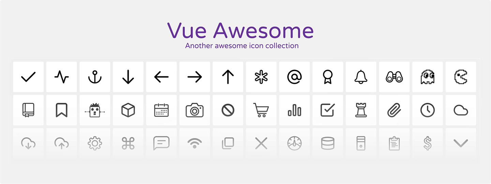

# Vue Awesome


Vue Awesome is another awesome collection of 170+ open source outline icons.

See [demo](https://codecrafting-net.github.io/vue-awesome/demo)

## Usage
You can manage the icons using the [IcoMoon Platform](https://icomoon.io/), just import the file `vue_awesome.json`. To use like a web font check the dist folder or you can install via bower like:

```
bower install vue-awesome-icons
```

## Credits
* [ProSymbols](https://thenounproject.com/prosymbols/)
* [Cole Bemis](http://colebemis.com/)
* [Victor Erixon](https://dribbble.com/victorerixon)
* [Keyamoon](http://keyamoon.com/)

## Licence
Vue Awesome is released under [GPLv2 LICENSE](https://www.gnu.org/licenses/old-licenses/gpl-2.0.html). In short, **you are free to use** the icons in any personal, open-source or commercial work. Pay attention to: same file license, accessible source, state changes and no warranty.
